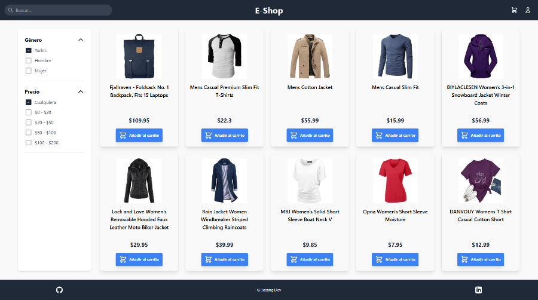

# 🛒 eCommerce Moderno

Este proyecto es una aplicación web moderna y responsive para explorar y comprar productos, desarrollada con **React**, **Vite** y **TailwindCSS**.


[🌐 Ver sitio en producción](https://e-commerce-two-xi-25.vercel.app/)

---

## 📸 Capturas de pantalla



---

## 🗂️ Estructura y funcionalidades

- **Catálogo de productos:** Visualiza productos filtrables por categoría, precio y búsqueda.
- **Carrito de compras:** Añade, elimina y ajusta cantidades de productos en el carrito con persistencia en localStorage.
- **Interfaz moderna:** Diseño limpio, profesional y responsive para móvil, tablet y escritorio.
- **Animaciones y feedback:** Interacciones visuales y animaciones suaves.
- **Accesibilidad:** Navegación por teclado y etiquetas ARIA.

---

## 🚀 Tecnologías y herramientas

- **React 19** — Biblioteca de JavaScript para interfaces de usuario
- **Vite** — Bundler ultrarrápido para desarrollo moderno
- **TailwindCSS** — Framework de utilidades CSS para diseño ágil
- **ESLint** — Linter para mantener calidad del código
- **PostCSS** — Procesador de CSS para optimización
- **TypeScript** — Tipado estático para mayor robustez

---

## 🧠 Metodología y optimización

- **Hooks y contexto:** Gestión de estado global del carrito con React Context y hooks.
- **Componentes reutilizables:** Arquitectura modular y mantenible.
- **Persistencia:** Carrito guardado en localStorage.
- **Optimización de rendimiento:** Renderizado eficiente y separación de lógica.
- **Accesibilidad:** ARIA labels y navegación por teclado.
- **Código limpio:** ESLint configurado y sin duplicados.

---

## 📁 Organización del proyecto

```
├── index.html
├── src/
│   ├── main.tsx              # Punto de entrada de la aplicación
│   ├── App.tsx               # Componente principal
│   ├── App.css               # Estilos específicos de la app
│   ├── index.css             # Tailwind + estilos globales
│   ├── context/              # Contexto global del carrito
│   │   ├── CartProvider.tsx  # Provider y lógica del carrito
│   │   └── CartContextDef.ts # Definición de contexto y tipos
│   ├── components/           # Componentes reutilizables
│   │   ├── Header.tsx        # Cabecera y buscador
│   │   ├── Sidebar.tsx       # Filtros de productos
│   │   ├── ProductList.tsx   # Listado de productos
│   │   ├── ProductCard.tsx   # Tarjeta de producto
│   │   ├── CartView.tsx      # Vista del carrito
│   │   ├── Footer.tsx        # Pie de página
│   │   └── AuthView.tsx      # Vista de autenticación simulada
│   ├── types/                # Tipos TypeScript globales
│   │   └── index.ts          # Definiciones de tipos
│   └── assets/               # Recursos estáticos (vacío)
├── public/                   # Archivos públicos
├── vite.config.ts            # Configuración de Vite
├── tailwind.config.js        # Configuración de Tailwind
├── postcss.config.js         # Configuración de PostCSS
├── eslint.config.js          # Configuración de ESLint
└── package.json
```

---

## 🛠️ Instalación y uso local

1. **Clona el repositorio:**
   ```bash
   git clone https://github.com/JosanglDev/ecommerce-moderno.git
   cd ecommerce-moderno
   ```

2. **Instala las dependencias:**
   ```bash
   npm install
   ```

3. **Inicia el servidor de desarrollo:**
   ```bash
   npm run dev
   ```
   Abre [http://localhost:5173](http://localhost:5173) en tu navegador.

4. **Ejecuta el linter:**
   ```bash
   npm run lint
   ```

---

## Build y despliegue

1. **Genera la versión de producción:**
   ```bash
   npm run build
   ```
   Los archivos listos para producción estarán en la carpeta `dist/`.

2. **Vista previa de producción:**
   ```bash
   npm run preview
   ```

3. **Despliegue en Vercel:**
   - Sube el repositorio a GitHub
   - Conecta el repo en [Vercel](https://vercel.com/)
   - Configura el directorio de salida como `dist`
   - ¡Listo! Vercel detecta automáticamente Vite y realiza el despliegue

---

## ✨ Características destacadas

- **🛍️ Catálogo filtrable:** Filtra productos por categoría, precio y búsqueda
- **🛒 Carrito persistente:** Añade, elimina y ajusta cantidades con persistencia
- **📱 Responsive:** Diseño adaptado a todos los dispositivos
- **⚡ Rendimiento:** Carga rápida y animaciones fluidas
- **💾 Persistencia:** Carrito guardado en localStorage
- **♿ Accesibilidad:** Navegación por teclado y ARIA labels
- **🎨 UI moderna:** Diseño limpio y profesional

---

## 🔧 Scripts disponibles

- `npm run dev` - Inicia el servidor de desarrollo
- `npm run build` - Genera la versión de producción
- `npm run preview` - Vista previa de la versión de producción
- `npm run lint` - Ejecuta el linter para verificar código

---

## 🤖 Uso de Inteligencia Artificial

El desarrollo del proyecto ha incorporado el uso de **Inteligencia Artificial** como apoyo para:
- Asistente personal.
- Automatización de tareas repetitivas.
- Refactoring y optimización de código.

---

## 👤 Autor

**José Antonio García López**  
Desarrollador Frontend junior.

- [GitHub](https://github.com/josangldev)
- [LinkedIn](https://www.linkedin.com/in/jos%C3%A9-antonio-garc%C3%ADa-l%C3%B3pez-4ba263347/)

---

## 📄 Licencia

MIT

---

## 🤝 Contribuciones

Las contribuciones son bienvenidas. Por favor, abre un issue o un pull request para sugerir mejoras o reportar bugs.
